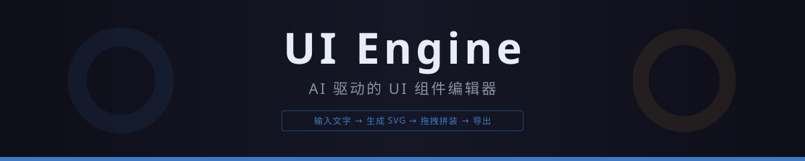
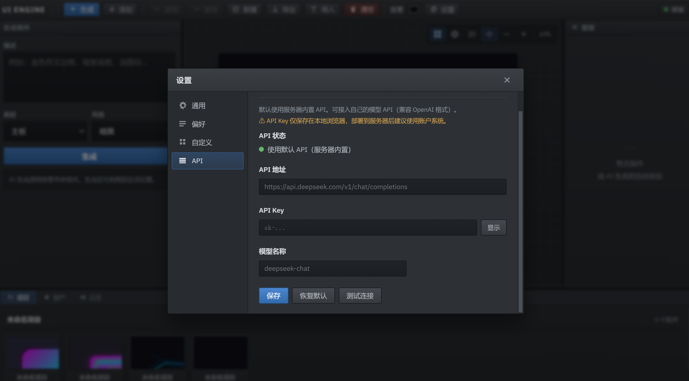
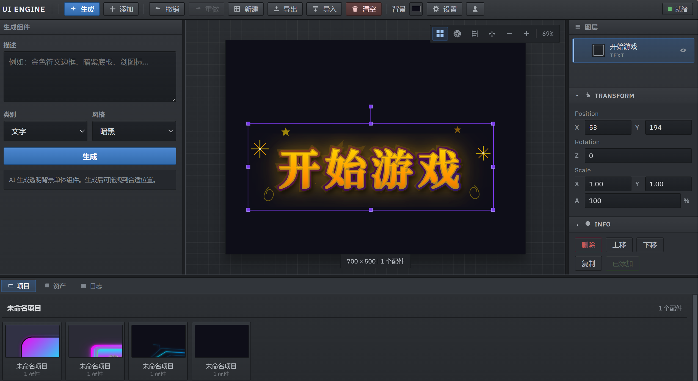

<p align="center">
  
</p>

<p align="center">
  <a href="https://uimagicai.com">
    
  </a>
  
  
  
  <a href="https://github.com/qwtui/ui-engine/discussions">
    
  </a>
</p>

<p align="center">
  <b><a href="https://uimagicai.com">👉 立即在线使用</a></b>
  ·
  <b><a href="#-api-文档">API 文档</a></b>
  ·
  <b><a href="#-社区">QQ 群</a></b>
  ·
  <b><a href="https://github.com/qwtui/ui-engine/discussions">Discussions</a></b>
</p>

---

## 这是什么？

**UI Engine** 是一个 AI 驱动的在线 UI 组件设计工具。

它不是"一键生成完整 UI"的噱头工具，而是一个 **AI + 编辑器** 的实用工作流：

1. **🤖 AI 生成素材** — 输入"金色符文边框"、"暗紫底板"，AI 即时生成透明底 SVG 组件
2. **🎨 画布拼装** — 在 Fabric.js 画布上拖拽、缩放、旋转、对齐，像搭积木一样搭界面
3. **📤 导出成品** — 导出 PNG/SVG/图层 PNG 或 .uiproj 项目文件

适合：**游戏 UI 设计**、**软件界面原型**、**HUD 元素制作**、**图标和装饰素材生成**

---

## 核心功能

| 功能 | 说明 |
|------|------|
| **AI 生成 5 大类组件** | 边框、底板、图标、装饰、文字 × 6 种视觉风格 |
| **画布编辑** | 缩放/平移/网格/吸附/对齐，类 Unity 编辑器体验 |
| **九宫格缩放** | 边框和底板任意缩放不变形 |
| **撤销/重做** | 50 步历史快照 |
| **图层管理** | 图层列表、拖拽排序、显隐控制 |
| **快捷键系统** | 可自定义绑定的快捷键 |
| **国际化** | 简体中文 / English |
| **自定义 API** | 可接入自己的 API（兼容 OpenAI 格式） |
| **并发生成** | 最大 3 任务并发 + 排队机制 |
| **用户系统** | 邮箱注册/登录/JWT 认证/密码修改 |

---

## 🖼️ 效果展示

<p align="center">
  
  <br>
  <sub>编辑器主界面 — 左侧 AI 生成区、中央画布、右侧图层/属性面板</sub>
</p>

<p align="center">
  
  <br>
  <sub>AI 生成的 UI 组件在画布中拼装</sub>
</p>

---

## 📡 API 文档

UI Engine 提供开放生成接口，可直接调用。

### 生成 UI 组件

```
POST https://uimagicai.com/api/part/generate
Content-Type: application/json
```

#### 请求参数

| 参数 | 类型 | 必填 | 默认值 | 说明 |
|------|------|------|--------|------|
| `prompt` | string | ✅ | — | 组件描述，如"金色符文边框" |
| `category` | string | ❌ | `plate` | 类别: `border`、`plate`、`icon`、`decoration`、`text` |
| `style` | string | ❌ | `dark` | 风格: `dark`、`default`、`light`、`neon`、`fantasy`、`sci-fi` |
| `api_config` | object | ❌ | `{}` | 自定义模型配置（endpoint / key / model） |

#### 请求示例

```bash
curl -X POST https://uimagicai.com/api/part/generate \
  -H "Content-Type: application/json" \
  -d '{"prompt": "金色符文边框", "category": "border", "style": "dark"}'
```

#### 响应示例

```json
{
  "status": "completed",
  "svg": "<svg xmlns=...>...</svg>",
  "svg_len": 1542,
  "elapsed": 3.5
}
```

#### 使用自定义 API

支持接入自己的模型（兼容 OpenAI Chat Completions 格式）：

```json
{
  "prompt": "暗紫色渐变底板",
  "category": "plate",
  "api_config": {
    "endpoint": "https://api.deepseek.com/v1/chat/completions",
    "key": "sk-xxx",
    "model": "deepseek-chat"
  }
}
```

---

## 💬 社区

| 渠道 | 链接 |
|------|------|
| 💬 **QQ 群** | [625119573](https://qm.qq.com/q/...) |
| 📧 **反馈** | [13170994336@163.com](mailto:13170994336@163.com) |
| 🐛 **Bug 反馈** | [创建 Issue](https://github.com/qwtui/ui-engine/issues/new) |
| ⭐ **项目点赞** | 点右上角 Star ✨ |

---

## 💝 赞助

完全免费使用。如果对你有帮助，欢迎自愿资助：

<p align="center">
  
</p>

---

<p align="center">
  <b><a href="https://uimagicai.com">✨ 立即开始使用 UI Engine →</a></b>
  <br>
  <sub>无需安装 · 在线免费使用</sub>
</p>
